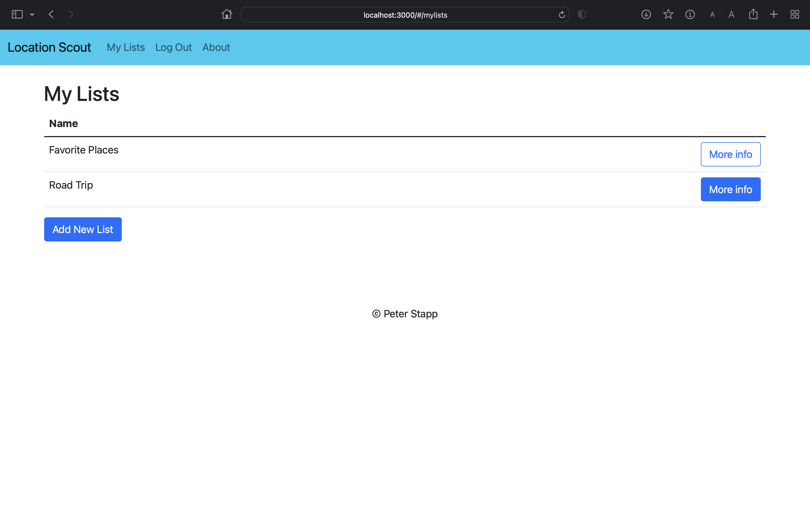
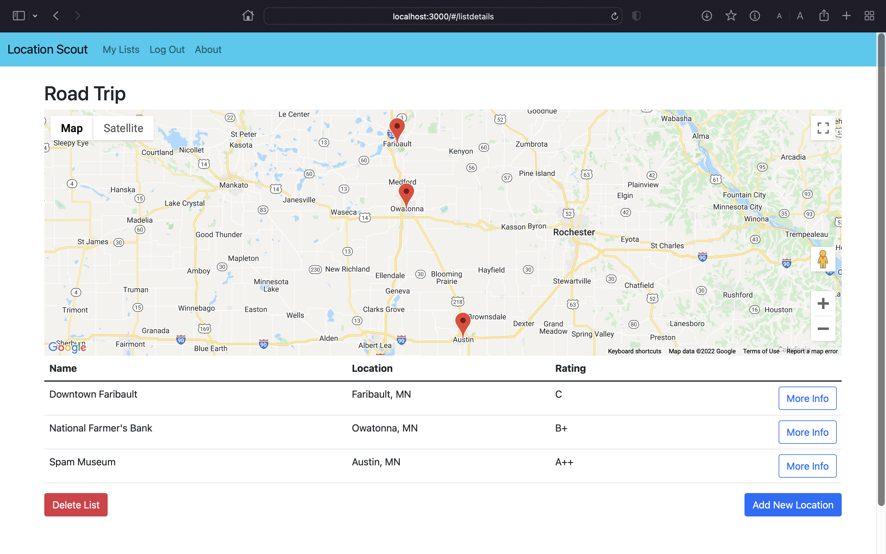
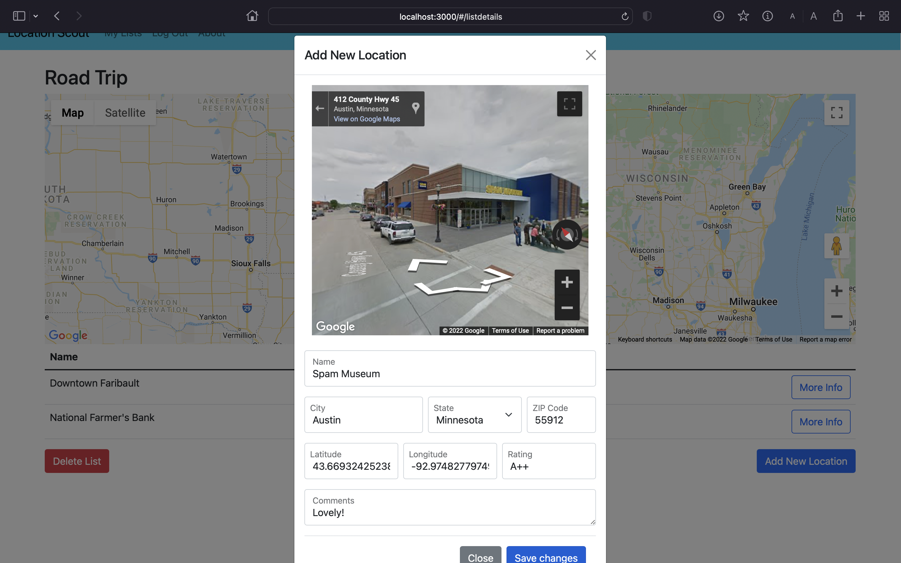
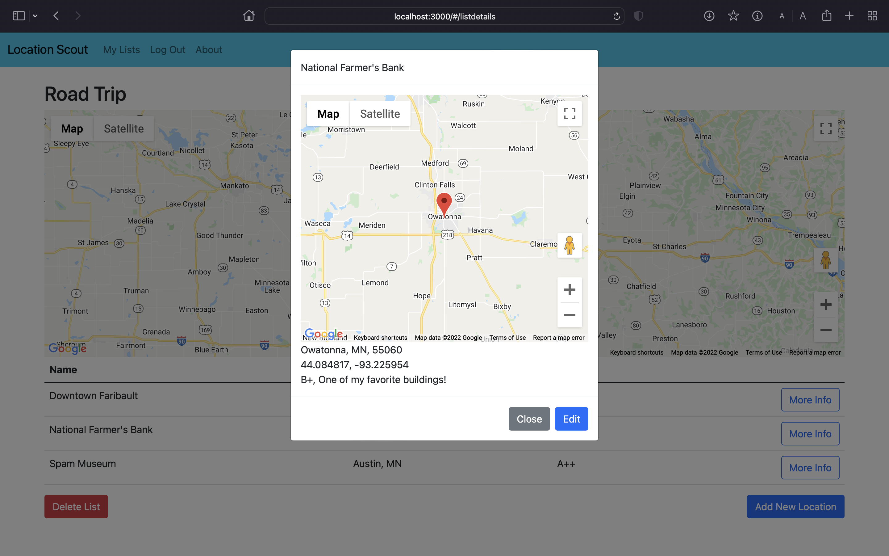

# Location Scout

## Description
My dad is a photographer who loves to travel around the Upper Midwest taking pictures of small towns. He has a big map printed out with letter grades on the towns for how photographic he deems them. I wanted to digitize this system to make it more manageable and accessible.

## Screenshots





## Built With
- React
- Javascript
- PostgreSQL
- Redux-Saga
- Node
- Express
- Google Maps API
- Bootstrap

## Installation
- Clone repository
- Create a new database named "location_scout" and run ```database.sql```
- In a terminal tab for the repository, type ```npm install``` to install dependencies
- In the same tab, type ```npm run server```
- In a seperate terminal tab, type ```npm run client```

## Usage
- Create an account on the registration page and will be redirected to the home page.
- Create a new list by pressing the "Create New List" button and typing in a name.
- Click "More Info" on each list to see a map of all locations.
- Click "Add New Location" and input information through the text inputs or clicking the location on the map widget.
- Click "More Info" on each location to see details and edit inputed information.